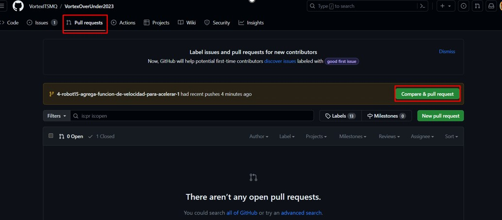

# VortexOverUnder2023

  

# Bienvenid@ a uno de los repositorios de 🌌VORTEX🌌

¡Hola y bienvenid@ al emocionante mundo de VORTEX! Este repositorio es tu puerta de entrada a toda la acción relacionada con la competencia VEX OVER UNDER 2023-2024. Aquí, encontrarás el corazón y el alma de nuestro equipo, representado en código, diseños y pasión.

## ¿Qué nos hace VORTEX?

**No estas solo, VORTEX siempre estará contigo💖**  
Nuestra filosofía es simple:  
"Solos llegamos más rápido🏃‍♀️🏃‍♂️ pero juntos PARTIMOS MADRES☠️!"   
Nunca olvides que cada línea de código que escribas y cada archivo que compartas contribuyen a algo más grande que tú mismo 🤟. 

## Tu Viaje con VORTEX🚀⭐

### 1. Crear un ISSUE💡

- Llena los detalles en la plantilla.
- Asigna múltiples personas, recuerda que el pair programming es efectivo.
- Agrega los tags para una organización efectiva.

### 2. Crear tu rama desde tu ISSUE🌲

- Accede a la sección de tu ISSUE.
- Si es necesario, cambia el nombre de tu rama siguiendo el formato `[IdIssue-TAG-Nombre-de-tu-rama]`. NO LO RECOMIENDO, SOLO HAZLO SI ES NECESARIO❗❗❗❗❗❗❗
- Haz clic en "Create branch" y copia los comandos proporcionados.
- Pega estos comandos en tu consola dentro de tu repositorio local.

### 3. Trabaja en tu ambiente local💻

- Ejecuta `git branch` para asegurarte de estar en tu rama.
- ¡Explora y programa con confianza!
- Cuando termines:
  - `git add .` para seleccionar los cambios.
  - `git commit -m "Mensaje Descriptivo"` para agregar un mensaje.
  - `git push` para enviar tus cambios al repositorio.

### 4. Crea un PULL REQUEST✉️

- Crea un PR después de tu último commit.
- RECUERDA QUE DEBE SALIRTE UN MENSAJE DE LA SIGUIENTE MANERA❗❗❗❗❗❗❗

- Llena la plantilla del PR y la checklist.
- Cambia la rama base según corresponda.
- Elige reviewers, asignados y tags.

### 5. Revisa un PULL REQUEST (Solo para revisores)👮‍♂️👮‍♀️

- Accede al PR y verifica asignaciones.
- Completa la checklist y coloca tu nombre.
- Escribe tu opinión en la sección "Add your review".
- Revisa el código con atención❗❗❗❗❗❗❗
- Acepta, comenta o rechaza el código.
- Ejecuta "SQUASH AND MERGE" para finalizar❗❗❗❗❗❗❗

## Comandos Básicos de Git🤸‍♀️🤸‍♂️🤸

- `git branch` - Ver las ramas existentes.
- `git checkout` - Cambiar a una rama específica.
- `git status` - Mostrar el estado de los cambios.
- `git pull` - Actualizar tu repositorio local con los cambios remotos.
- `git push` - Enviar tus cambios al repositorio remoto.
- `git add .` - Añadir cambios al área de preparación.
- `git fetch` - Obtener cambios remotos (sin fusionarlos).
- `git commit -m` - Hacer un commit con un mensaje descriptivo.
- `git checkout -b` - Crear y cambiar a una nueva rama.
- `git rebase` - Reorganizar commits en una rama.
 

  
¡Gracias por unirte al emocionante viaje de VORTEX! Estamos ansiosos por ver tus contribuciones brillar.

